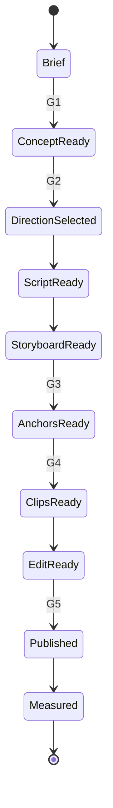

# FableFlow 架构设计

## 1. 设计目标

FableFlow v0.2 是一个**结构化的寓言视频生产协议**。它不试图一次完成全自动电影生成，而是让不同模型各自承担最稳定的工作：

- GPT-5.5：知识机制、故事、脚本、故事板和生产任务设计。
- gpt-image-2：角色身份、服装、场景和镜头参考帧。
- Seedance：动作、运镜、光影变化和可选环境声。
- 剪映：精确旁白、字幕、节奏、字卡、混音和最终导出。

## 2. 分层

### 知识层

`episode-brief.json` 和 `concept-sheet.json` 保证“讲得对”。

### 叙事层

`story-options.json`、`decision.json` 和 `script.json` 保证“愿意看”。

### 导演层

`storyboard.json` 将完整故事拆成 10–15 个单一意图镜头，明确时间、动作、画面、旁白和声音功能。

### 身份锚点层

`asset-manifest.json` 定义 gpt-image-2 需要生成的角色锚点、场景锚点和镜头参考帧。该层只解决“是谁、在哪里、长什么样”，不承担复杂运动。

### 视频生成层

`video-manifest.json` 把故事板转成 Seedance 任务，明确：

- 生成模式。
- 参考资产。
- 唯一主要动作。
- 唯一主要运镜。
- 时间线时长与建议生成时长。
- 原生音频策略。
- 连续性约束、审核条件和降级方案。

### 成片层

`publish-pack.json`、`subtitles.srt` 和 `edit-list.csv` 负责剪映装配。旁白始终独立于 Seedance 视频片段。

### 数据层

除平台指标外，还记录 Seedance 首次通过率、重生成次数、静帧降级数量、成本和生产时间。

## 3. 状态机

## 4. 自动化边界

### v0.2 自动化

- 创建分集目录。
- JSON Schema 与跨文件覆盖校验。
- 生成 SRT。
- 生成包含 Seedance 片段、参考图和音频策略的剪映装配 CSV。

### v0.2 人工触发

- GPT-5.5 和 gpt-image-2 生成。
- Seedance 逐镜生成、候选选择与返工。
- 剪映总装与发布。

### 后续 API 化

只有在至少 10 期验证后，再实现 Seedance provider adapter、任务轮询、素材下载、失败重试、成本统计和授权元数据。
