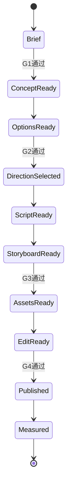

# FableFlow 架构设计

## 1. 设计目标

FableFlow 首版不是自动剪辑软件，而是一个**结构化内容生产协议**。它解决四个问题：

1. GPT-5.5 的输出如何稳定交接给下一阶段。
2. 故事如何保证概念机制准确，而不是只做表面类比。
3. gpt-image-2 如何复用统一角色和风格，降低镜头漂移。
4. 剪映制作如何由“凭感觉剪”变成有装配清单的标准流程。

## 2. 分层

### 2.1 知识层

- `episode-brief.json`：为什么做这一期。
- `concept-sheet.json`：概念的机制、边界、误解和现实案例。

知识层不写故事，负责保证“讲得对”。

### 2.2 叙事层

- `story-options.json`：三个不同寓言方向。
- `decision.json`：人工选择及修改意见。
- `script.json`：最终旁白结构。

叙事层负责“愿意看”，但不得破坏知识层约束。

### 2.3 视觉层

- `storyboard.json`：逐镜头时间、内容、情绪和画面要求。
- `asset-manifest.json`：需要生成、复用或仅用字卡完成的资产。
- `bibles/`：角色和画风的长期基准。

视觉层负责“画得出、接得上、角色不漂”。

### 2.4 成片层

- `publish-pack.json`：标题、封面、旁白、互动和标识文案。
- `subtitles.srt`：字幕导入。
- `edit-list.csv`：剪映逐镜头装配清单。

成片层负责“剪得快、发得稳”。

### 2.5 数据层

- `analytics/episode-metrics.csv`：记录内容变量与平台表现。

数据层不只记录播放量，更关注：前 3 秒留存、完播率、转发率、收藏率和评论猜中率。

## 3. 状态机

任一 Gate 未通过时只回退到最近的可修复阶段，避免整期重做。

## 4. 自动化边界

### 当前自动化

- 创建标准分集目录。
- JSON Schema 校验。
- 从故事板生成 SRT。
- 从故事板和资产清单生成剪辑 CSV。

### 当前人工触发

- GPT-5.5 对话或 API 调用。
- gpt-image-2 出图与筛选。
- 剪映导入、微动、配音、音乐和成片。

### 后续可自动化

- OpenAI API 编排。
- Prompt 版本与结果追踪。
- 图片生成任务队列。
- 自动生成低清审片视频。
- 平台数据抓取和选题推荐。
